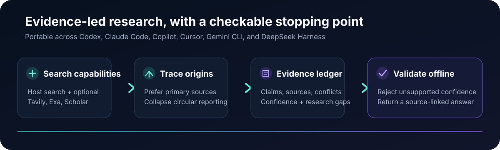

# SandBase Skills

[English](./README.md) | [中文](./README.zh-CN.md) | [日本語](./README.ja.md) | [한국어](./README.ko.md) | [Español](./README.es.md) | [Français](./README.fr.md) | Deutsch | [Português](./README.pt-BR.md)

**88 installierbare Agent Skills** — Für Recherche, Social Intelligence, Marketing und Business-Workflows. Der zentrale Recherche-Skill nutzt die vorhandenen Suchwerkzeuge des Agents und benötigt kein SandBase-Konto; SandBase ist nur für zusätzliche spezialisierte Datenquellen erforderlich.

Beginnen Sie mit `multi-source-search`: Der Skill nutzt die vorhandenen Suchwerkzeuge des Agents und enthält ein Beispiel-Evidenzprotokoll sowie einen Offline-Validator. Wenn er einen echten Workflow verbessert, [geben Sie dem Repository einen Star](https://github.com/sandbaseai/sandbase-skills), damit andere Entwickler ihn leichter entdecken können.



## Schnellstart

```bash
# Den vollständigen Skill-Prompt ohne Installation erzeugen
npx skills use sandbaseai/sandbase-skills@multi-source-search

# Oder in Codex installieren
npx skills add sandbaseai/sandbase-skills --skill multi-source-search --agent codex

# Mit den vorhandenen Websuch- und Seitenlese-Werkzeugen des Agents nutzen
# "Prüfe diese Behauptung mit unabhängigen Quellen und validiere das Evidenzprotokoll"
```

### DeepSeek Harness

Im Stammverzeichnis eines DeepSeek-Harness-Projekts ausführen:

```bash
npx --yes github:sandbaseai/sandbase-skills add multi-source-search
dsh web
```

Der Installer kopiert den vollständigen Skill nach `.dsh/skills/multi-source-search`, das projektbezogene Discovery-Verzeichnis. Er läuft direkt aus der GitHub-Quelle; eine npm-Veröffentlichung oder ein SandBase-Konto ist nicht erforderlich.

## Kategorien (88 Skills)

| Kategorie | Anzahl | Anwendungsfälle |
|-----------|--------|-----------------|
| **Social Intelligence** | 14 | Twitter, YouTube, Instagram, TikTok, Reddit, Xiaohongshu |
| **Suche & Recherche** | 17 | Multi-Source, Akademisch, Trends, News |
| **Business Intelligence** | 20 | Unternehmen, Wettbewerb, Vertrieb, Talente |
| **Marketing** | 15 | Marke, Influencer, Social Listening, Krise |
| **SEO** | 5 | Keywords, Backlinks, SERP, Audit |
| **Tools** | 17 | E-Mail, Domains, Screenshots, Übersetzung |

Vollständige Liste im [englischen README](./README.md#skill-catalog-88-skills).

## Unterstützte Agents

Claude Code, Codex, Cursor, Gemini CLI, OpenClaw, Hermes, Amp, Devin

## Preise

Skills sind kostenlos und Open Source (Apache-2.0). `multi-source-search` benötigt mit den vorhandenen Agent-Werkzeugen weder ein SandBase-Konto noch SandBase-API-Kosten; spezialisierte Skills können SandBase nutzungsbasiert ergänzen.

---

**[SandBase Skills](https://github.com/sandbaseai/sandbase-skills)** — 88 Open-Source Agent Skills mit optionalen spezialisierten Datenquellen.
