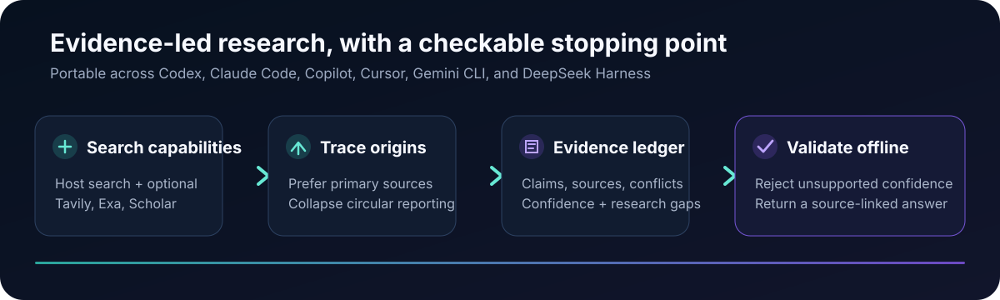

# SandBase Skills

[](https://github.com/sandbaseai/sandbase-skills/stargazers)
[](https://github.com/sandbaseai/sandbase-skills/actions/workflows/validate.yml)
[](https://skills.sh/sandbaseai/sandbase-skills)
[](https://agentskill.sh/@sandbaseai)
[](https://github.com/sandbaseai/sandbase-skills/releases/latest)
[](https://github.com/sandbaseai/sandbase-skills/discussions)
[](LICENSE)

**Browse the flagship Skill:** [skills.sh](https://skills.sh/sandbaseai/sandbase-skills/multi-source-search) · [Agentic Awesome Skills](https://github.com/sickn33/agentic-awesome-skills/tree/main/skills/multi-source-search) · [Agent Skill Exchange](https://github.com/agentskillexchange/skills/tree/main/skills/cross-validate-research-with-sandbase-multi-source-search) · [askill](https://askill.sh/skills/gh/sandbaseai/sandbase-skills/@multi-source-search) · [Awesome Skills](https://www.awesomeskills.dev/en/skill/sandbase-skills-multi-source-search) · [skills.re](https://skills.re/skills/sandbaseai/sandbase-skills/multi-source-search) · [SkillsCat](https://skills.cat/skills/sandbaseai/sandbase-skills/multi-source-search) · [OpenAgentSkill](https://www.openagentskill.com/skills/sandbaseai-sandbase-skills-multi-source-search) · [AgentSkill.sh](https://agentskill.sh/@sandbaseai)

Have a repeatable workflow that is missing? [Request a Skill](https://github.com/sandbaseai/sandbase-skills/issues/new?template=skill_request.yml) with a public example and acceptance criteria.

[English](./README.md) | [中文](./README.zh-CN.md) | [日本語](./README.ja.md) | [한국어](./README.ko.md) | [Español](./README.es.md) | [Français](./README.fr.md) | [Deutsch](./README.de.md) | [Português](./README.pt-BR.md)

**245 installable Agent Skills** for research, social intelligence, marketing, media generation, software engineering, data science, and business workflows. Install into any compatible agent (DeepSeek Harness, Claude Code, Codex, Cursor, Gemini CLI) and start working immediately. The flagship research Skill works with host-provided search tools; connect SandBase when you want broader provider coverage.

SandBase also exposes [2,000+ models and APIs](https://www.sandbase.ai/docs/store/),
including a unified surface for [LLM, image, and video generation](https://blog.sandbase.ai/unified-ai-api-llm-image-video-2026/).
Skills define the workflow; the SandBase API or MCP bridge supplies optional model,
media, search, social, and data capabilities when a workflow needs them.

Start with `multi-source-search`: it runs with your agent's existing search tools,
ships a worked evidence-ledger example, and includes an offline validator. If it
improves a real workflow, [star the repository](https://github.com/sandbaseai/sandbase-skills)
so other builders can discover it.



## What are Skills?

A Skill is an instruction file that teaches an AI agent how to do one specific job. Each Skill defines a repeatable workflow, evidence rules, and output format. Portable Skills can use capabilities already provided by the host agent; specialized social, market, and data workflows can add SandBase providers when configured.

## Quick Start

```bash
# Try it without installing: generate the complete Skill prompt
npx skills use sandbaseai/sandbase-skills@multi-source-search

# Or install it into Codex
npx skills add sandbaseai/sandbase-skills@multi-source-search --agent codex

# Use it with your agent's existing web/search tools
# "Fact-check this claim with independent sources and validate the evidence ledger"
```

`multi-source-search` needs no SandBase account when the host agent already provides
search and page-reading tools. For specialized social, market, and data-provider Skills,
set `SANDBASE_API_KEY` in your environment—never in a prompt or committed file.

### GitHub CLI (official Agent Skills workflow)

GitHub CLI 2.90.0 or later can preview a Skill before installing it. Because this
repository groups Skills by domain, pass the exact path shown in the catalog:

```bash
# Inspect the instructions and bundled files without installing anything
gh skill preview sandbaseai/sandbase-skills research/multi-source-search

# Install it for Codex at user scope
gh skill install sandbaseai/sandbase-skills research/multi-source-search \
  --agent codex --scope user
```

Replace the final path with another linked Skill path from the catalog below. See
GitHub's [`gh skill` documentation](https://cli.github.com/manual/gh_skill) for
supported agents, version pinning, updates, and security guidance.

### Portable Agent Plugin (Copilot CLI and compatible clients)

Install the curated, account-free research plugin directly from this repository:

```bash
copilot plugin install sandbaseai/sandbase-skills:agent-plugin
```

The plugin follows the vendor-neutral [Agent Plugins 1.0 specification](https://agent-plugins.org/)
and currently packages `multi-source-search` with its references and offline evidence-ledger
validator. Its generated Skill copy is checked against the canonical source in CI.

### Add SandBase MCP tools to the same agent

Skills provide repeatable instructions; [SandBase CLI](https://github.com/sandbaseai/cli)
adds six MCP tools for discovering and running 2,000+ models and APIs. Connect one of
the 25 supported client targets, then use these Skills and MCP tools in the same agent:

```bash
npx -y https://github.com/sandbaseai/cli/releases/download/v0.1.17/sandbaseai-cli-0.1.17.tgz connect --client codex
```

Replace `codex` with another client ID from the
[verified catalog](https://github.com/sandbaseai/cli/blob/main/llms-install.md).
If the bridge is useful in your workflow, [star SandBase CLI](https://github.com/sandbaseai/cli/stargazers)
so other agent users can discover it.

### DeepSeek Harness

Install all 245 Skills as a native DSH bundle:

```bash
dsh plugin --profile web add github:sandbaseai/sandbase-skills
dsh web
```

The bundle mounts the packaged `marketing/` and `research/` directories through
DSH's filesystem Skill provider while preserving the default Skill roots.

To copy only the flagship Skill into one project's
`.dsh/skills/multi-source-search` directory:

```bash
npx --yes github:sandbaseai/sandbase-skills add multi-source-search
```

The single-Skill installer and the bundle both run directly from the GitHub source,
so no npm publication or SandBase account is required.

### Claude Code marketplace

Install all 245 Skills as a native Claude Code plugin:

```text
/plugin marketplace add sandbaseai/sandbase-skills
/plugin install sandbase-skills@sandbase-agent-skills
```

The marketplace manifest lists every Skill explicitly, so Claude Code can discover
them on demand without copying directories by hand.

### Verify research output offline

The [`multi-source-search`](research/multi-source-search/SKILL.md) Skill produces an
evidence ledger that can be checked before you trust or share its synthesis:

See the [complete worked example](examples/branch-protection-research.md), which
cross-checks one claim against primary documentation from GitHub, GitLab, and Atlassian.

```bash
python3 research/multi-source-search/scripts/validate_report.py \
  examples/verifiable-research-report.json
# VALID: 3 source(s), 1 claim(s), 2 provider(s)
```

The validator rejects unknown or duplicate sources, inflated confidence, unused
evidence, and high-confidence claims that still have a declared conflict. It runs
offline and checks internal consistency; it does not claim that a source is true.

For an end-to-end example that runs this research contract inside a governed,
sandboxed runtime, read
[Build an Auditable Research Agent](https://blog.sandbase.ai/auditable-research-agent-evidence-ledger-sandbox-replay/).

## Try a Real Workflow

Install the matching Skill, then give your agent one of these tasks:

| Skill | Example task | What you get | Install |
| --- | --- | --- | --- |
| [`twitter-intelligence`](research/twitter-intelligence/SKILL.md) | “Compare sentiment and recurring complaints for Brand A and Brand B on X this month.” | Source-linked posts, trends, accounts, and a structured comparison | [skills.sh](https://www.skills.sh/sandbaseai/sandbase-skills/twitter-intelligence) |
| [`multi-source-search`](research/multi-source-search/SKILL.md) | “Verify the strongest evidence for and against this market claim.” | Cross-checked web and academic findings with disagreements called out | [skills.sh](https://www.skills.sh/sandbaseai/sandbase-skills/multi-source-search) |
| [`competitor-monitor`](research/competitor-monitor/SKILL.md) | “Track three competitors’ pricing, launches, content, and social activity.” | A dated competitive-intelligence brief with observed changes | [skills.sh](https://www.skills.sh/sandbaseai/sandbase-skills/competitor-monitor) |
| [`seo-content-brief`](research/seo-content-brief/SKILL.md) | “Build a writer-ready brief for this target keyword.” | Search intent, competing pages, required subtopics, and differentiation angles | [skills.sh](https://www.skills.sh/sandbaseai/sandbase-skills/seo-content-brief) |
| [`github-profile-research`](research/github-profile-research/SKILL.md) | “Assess this engineering team’s open-source activity.” | Repository, language, contribution, star, and activity analysis | [skills.sh](https://www.skills.sh/sandbaseai/sandbase-skills/github-profile-research) |
| [`youtube-research`](research/youtube-research/SKILL.md) | “Map the leading channels and audience questions in this niche.” | Video and channel discovery, transcript evidence, and comment themes | [skills.sh](https://www.skills.sh/sandbaseai/sandbase-skills/youtube-research) |

## Skill Catalog (245 Skills)

### Social Intelligence (14 Skills)

Research and monitor conversations across every major social platform.

| Skill | Platform | Use it to |
|---|---|---|
| `twitter-intelligence` | Twitter/X | Search tweets, track trends, analyze users, monitor sentiment |
| `youtube-research` | YouTube | Search videos, analyze channels, extract transcripts, read comments |
| `instagram-research` | Instagram | Analyze profiles, track hashtags, research content strategies |
| `tiktok-research` | TikTok | Search videos, analyze creators, track hashtag challenges |
| `linkedin-research` | LinkedIn | Research companies, professionals, job markets |
| `reddit-research` | Reddit | Search discussions, monitor communities, discover trends |
| `xiaohongshu-research` | Xiaohongshu (RED) | Search notes, analyze creators, track consumer trends |
| `weibo-research` | Weibo | Monitor hot searches, track trending topics, analyze sentiment |
| `douyin-research` | Douyin | Search videos, analyze creators, track challenges |
| `wechat-channels-research` | WeChat Channels | Search videos, analyze live streams |
| `wechat-mp-research` | WeChat Official Accounts | Research articles, analyze accounts |
| `wechat-search` | WeChat | Search across WeChat ecosystem |
| `china-social-research` | Multi-platform | Cross-platform China social research |
| `community-research` | Reddit + Telegram | Online community analysis |

### Search & Research (24 Skills)

Find, validate, and synthesize information from multiple sources.

| Skill | Use it to |
|---|---|
| `multi-source-search` | Cross-validate research with host search tools and optional Tavily, Exa, Scholar, and Cloudsway coverage |
| `tavily-deep-research` | Advanced web search with content extraction and site mapping |
| `exa-deep-search` | Semantic search and source extraction with Exa |
| `exa-similar-finder` | Find pages similar to any URL |
| `academic-research` | Search scholarly papers with AI-powered explanations |
| `academic-trend-research` | Track emerging research areas and breakthrough papers |
| `google-news-research` | Monitor news articles and media coverage |
| `web-scraper` | Scrape pages, crawl sites, extract structured data |
| `last30days-research` | Multi-platform research for the last 30 days |
| `topic-deep-dive` | Exhaustive multi-source topic research |
| `event-tracker` | Track events in real-time across platforms |
| `trend-spotter` | Spot emerging trends across platforms |
| `news-aggregator` | Aggregate news from multiple sources |
| `market-research` | Comprehensive market intelligence |
| `newsletter-research` | Discover industry newsletters and publications |
| `podcast-research` | Find podcasts and episodes by topic |
| `content-ideation` | Generate data-backed content ideas |
| `internet-skill-finder` | Find and verify installable Agent Skills from current public repositories |
| `database-lookup` | Research and verify Database Lookup with explicit validation and safety boundaries |
| `github-gem-seeker` | Research and verify GitHub Gem Seeker with explicit validation and safety boundaries |
| `hackernews-frontpage` | Research and verify Hacker News Front Page with explicit validation and safety boundaries |
| `microsoft-code-reference` | Research and verify Microsoft Code Reference with explicit validation and safety boundaries |
| `microsoft-docs` | Research and verify Microsoft Docs with explicit validation and safety boundaries |
| `usfiscaldata` | Research and verify U.S. Fiscal Data with explicit validation and safety boundaries |

### Business Intelligence (28 Skills)

Company research, sales intelligence, and competitive analysis.

| Skill | Use it to |
|---|---|
| `apollo-company-research` | Search companies, enrich profiles, track hiring |
| `akta-company-research` | Research companies via employee and product reviews |
| `company-enrichment` | Enrich company data from multiple sources |
| `google-maps-reviews` | Analyze local business reviews |
| `product-intelligence` | Cross-platform product market research |
| `product-review-extractor` | Extract and analyze product reviews at scale |
| `competitive-pricing` | Benchmark pricing against competitors |
| `pricing-page-analyzer` | Extract and analyze competitor pricing |
| `review-aggregator` | Aggregate reviews from multiple platforms |
| `startup-research` | Research startups with funding, team, and traction |
| `hiring-intelligence` | Analyze hiring patterns and talent competition |
| `talent-sourcing` | Source candidates by skills and expertise |
| `lead-research` | Build complete prospect profiles |
| `outreach-builder` | Build verified outreach lists |
| `email-outreach-prep` | Prepare personalized email outreach |
| `sales-intelligence` | Account intelligence for sales conversations |
| `partnership-research` | Qualify potential partners with data |
| `industry-landscape` | Map any industry's competitive landscape |
| `local-market-research` | Research local markets with reviews and social data |
| `data-enrichment` | Fill data gaps with verified intelligence |
| `stock-analysis` | Research public companies with current market, ownership, and filing evidence |
| `similarweb-analytics` | Compare estimated website traffic, engagement, channels, and geography |
| `market-sizing-analysis` | Calculate evidence-backed TAM, SAM, and SOM ranges |
| `variance-analysis` | Decompose financial variances into business drivers |
| `reconciliation` | Match account data and classify open differences |
| `cash-flow-snapshot` | Forecast 30/60/90-day cash flow and liquidity risks |
| `sales-enablement` | Create buyer-specific sales collateral |
| `prd` | Turn product ideas into measurable requirements |

### Business & Operations (12 Skills)

Plan and verify operational, financial, legal, and decision-support workflows.

| Skill | Use it to |
|---|---|
| `audit-support` | Plan and verify Audit Support with explicit validation and safety boundaries |
| `brainstorm-experiments-new` | Plan and verify Brainstorm Experiments New with explicit validation and safety boundaries |
| `business-model` | Plan and verify Business Model with explicit validation and safety boundaries |
| `call-prep` | Plan and verify Call Prep with explicit validation and safety boundaries |
| `close-management` | Plan and verify Close Management with explicit validation and safety boundaries |
| `daily-briefing` | Plan and verify Daily Briefing with explicit validation and safety boundaries |
| `journal-entry-prep` | Plan and verify Journal Entry Prep with explicit validation and safety boundaries |
| `lean-canvas` | Plan and verify Lean Canvas with explicit validation and safety boundaries |
| `legal-risk-assessment` | Plan and verify Legal Risk Assessment with explicit validation and safety boundaries |
| `meeting-briefing` | Plan and verify Meeting Briefing with explicit validation and safety boundaries |
| `revops` | Plan and verify Revenue Operations with explicit validation and safety boundaries |
| `team-composition-analysis` | Plan and verify Team Composition Analysis with explicit validation and safety boundaries |


### Marketing & Content (25 Skills)

Brand monitoring, influencer marketing, and content strategy.

| Skill | Use it to |
|---|---|
| `brand-monitoring` | Track brand mentions across all platforms |
| `kol-discovery` | Find and evaluate influencers across platforms |
| `influencer-analytics` | Analyze influencer performance with engagement data |
| `social-listening` | Monitor conversations about any topic globally |
| `competitor-content-intelligence` | Find differentiated content opportunities |
| `competitor-monitor` | Monitor competitor launches, pricing, campaigns, and market signals |
| `thought-leadership-monitor` | Track industry voices and their content |
| `pr-media-monitor` | Track press mentions and media narrative |
| `content-performance` | Analyze content performance across platforms |
| `audience-research` | Understand target audiences from community data |
| `social-proof-research` | Find authentic testimonials and endorsements |
| `competitor-ad-research` | Research competitor advertising strategies |
| `hashtag-tracker` | Track hashtag performance across platforms |
| `crisis-monitor` | Detect and assess crises before they escalate |
| `reddit-customer-insights` | Discover customer language and pain points |
| `listicle-blog-writer` | Research and write transparent, evidence-backed best-of articles |
| `ai-seo` | Create or review AI SEO with explicit validation and safety boundaries |
| `alternative-blog-writer` | Create or review Alternative Blog Writer with explicit validation and safety boundaries |
| `churn-prevention` | Create or review Churn Prevention with explicit validation and safety boundaries |
| `comparison-article-writer` | Create or review Comparison Article Writer with explicit validation and safety boundaries |
| `copy-editing` | Create or review Copy Editing with explicit validation and safety boundaries |
| `grammar-check` | Create or review Grammar Check with explicit validation and safety boundaries |
| `humanizer` | Create or review Humanizer with explicit validation and safety boundaries |
| `marketing-ideas` | Create or review Marketing Ideas with explicit validation and safety boundaries |
| `marketing-psychology` | Create or review Marketing Psychology with explicit validation and safety boundaries |

### Marketing & SEO (8 Skills)

Search engine optimization, SERP analysis, and technical auditing.

| Skill | Use it to |
|---|---|
| `seo-keyword-insights` | Build evidence-backed keyword strategies with DataForSEO |
| `backlink-gap-analysis` | Find ethical backlink gaps against competitors |
| `serp-analysis` | Analyze live Google SERP results and features |
| `seo-content-brief` | Generate SERP-backed content briefs |
| `site-audit` | Audit website content, structure, and SEO health |
| `programmatic-seo` | Design and validate data-driven SEO page families |
| `backlink-analysis` | Analyze Backlink Analysis with explicit validation and safety boundaries |
| `seo-competitor-analysis` | Analyze Seo Competitor Analysis with explicit validation and safety boundaries |

### Media Generation (4 Skills)

Plan, generate, assemble, and verify multimedia deliverables.

| Skill | Use it to |
|---|---|
| `video-generator` | Produce cost-aware multi-shot videos with SandBase image, video, music, and speech models |
| `music-prompter` | Design prompts and generate cost-aware songs, instrumentals, and multi-part music with SandBase |
| `manim-animator` | Build reproducible mathematical and explanatory animations with optional SandBase media |
| `game-dev` | Build and verify playable browser games with optional SandBase-generated assets |

### Design & Media (30 Skills)

Create and review interfaces, diagrams, animation, and editable media.

| Skill | Use it to |
|---|---|
| `accessibility-review` | Create or review Accessibility Review with explicit validation and safety boundaries |
| `beautiful-article` | Create or review Beautiful Article with explicit validation and safety boundaries |
| `captions-overlay` | Create or review Captions Overlay with explicit validation and safety boundaries |
| `cut-the-curve` | Create or review Cut The Curve with explicit validation and safety boundaries |
| `emil-design-eng` | Create or review Design Engineering Craft with explicit validation and safety boundaries |
| `excalidraw-diagram-generator` | Create or review Excalidraw Diagram Generator with explicit validation and safety boundaries |
| `gsap-core` | Create or review GSAP Core with explicit validation and safety boundaries |
| `gsap-frameworks` | Create or review GSAP Framework Integrations with explicit validation and safety boundaries |
| `gsap-plugins` | Create or review GSAP Plugins with explicit validation and safety boundaries |
| `gsap-react` | Create or review GSAP React with explicit validation and safety boundaries |
| `gsap-scrolltrigger` | Create or review GSAP ScrollTrigger with explicit validation and safety boundaries |
| `gsap-timeline` | Create or review GSAP Timeline with explicit validation and safety boundaries |
| `gsap-utils` | Create or review GSAP Utilities with explicit validation and safety boundaries |
| `html-video-production` | Create or review HTML Video Production with explicit validation and safety boundaries |
| `hyperframes-keyframes` | Create or review Hyperframes Keyframes with explicit validation and safety boundaries |
| `hyperframes-registry` | Create or review Hyperframes Registry with explicit validation and safety boundaries |
| `image-manipulation-image-magick` | Create or review ImageMagick Image Manipulation with explicit validation and safety boundaries |
| `json-canvas` | Create or review JSON Canvas with explicit validation and safety boundaries |
| `legacy-circuit-mockups` | Create or review Legacy Circuit Mockups with explicit validation and safety boundaries |
| `markdown-mermaid-writing` | Create or review Markdown and Mermaid Writing with explicit validation and safety boundaries |
| `markdown-to-html` | Create or review Markdown To Html with explicit validation and safety boundaries |
| `oversized-cursor` | Create or review Oversized Cursor with explicit validation and safety boundaries |
| `penpot-uiux-design` | Create or review Penpot UI/UX Design with explicit validation and safety boundaries |
| `plantuml-ascii` | Create or review PlantUML ASCII with explicit validation and safety boundaries |
| `playground` | Create or review Playground with explicit validation and safety boundaries |
| `review-animations` | Create or review Review Animations with explicit validation and safety boundaries |
| `seam-craft` | Create or review Seam Craft with explicit validation and safety boundaries |
| `tailwind-design-system` | Create or review Tailwind Design System with explicit validation and safety boundaries |
| `video-template-frame-glitch-title` | Create or review Video Template Frame Glitch Title with explicit validation and safety boundaries |
| `video-template-frame-light-leak-cinema` | Create or review Video Template Frame Light Leak Cinema with explicit validation and safety boundaries |


### Data Science & Analytics (27 Skills)

Build reproducible statistics, machine-learning, visualization, and data-engineering workflows.

| Skill | Use it to |
|---|---|
| `airflow-dag-patterns` | Build reproducible Airflow Dag Patterns with explicit validation and safety boundaries |
| `backtesting-frameworks` | Build reproducible Backtesting Frameworks with explicit validation and safety boundaries |
| `dask` | Build reproducible Dask with explicit validation and safety boundaries |
| `data-context-extractor` | Build reproducible Data Context Extractor with explicit validation and safety boundaries |
| `data-visualization` | Build reproducible Data Visualization with explicit validation and safety boundaries |
| `dbt-transformation-patterns` | Build reproducible dbt Transformation Patterns with explicit validation and safety boundaries |
| `experimental-design` | Build reproducible Experimental Design with explicit validation and safety boundaries |
| `huggingface-datasets` | Build reproducible Hugging Face Datasets with explicit validation and safety boundaries |
| `matplotlib` | Build reproducible Matplotlib with explicit validation and safety boundaries |
| `networkx` | Build reproducible NetworkX with explicit validation and safety boundaries |
| `polars` | Build reproducible Polars with explicit validation and safety boundaries |
| `powerbi-modeling` | Build reproducible Power BI Modeling with explicit validation and safety boundaries |
| `risk-metrics-calculation` | Build reproducible Risk Metrics Calculation with explicit validation and safety boundaries |
| `seaborn` | Build reproducible Seaborn with explicit validation and safety boundaries |
| `shap` | Build reproducible SHAP with explicit validation and safety boundaries |
| `single-cell-rna-qc` | Build reproducible Single-Cell RNA QC with explicit validation and safety boundaries |
| `spark-optimization` | Build reproducible Spark Optimization with explicit validation and safety boundaries |
| `sql-optimization-patterns` | Build reproducible SQL Optimization Patterns with explicit validation and safety boundaries |
| `sql-queries` | Build reproducible SQL Queries with explicit validation and safety boundaries |
| `stable-baselines3` | Build reproducible Stable-Baselines3 with explicit validation and safety boundaries |
| `statistical-power` | Build reproducible Statistical Power with explicit validation and safety boundaries |
| `statsmodels` | Build reproducible Statsmodels with explicit validation and safety boundaries |
| `sympy` | Build reproducible SymPy with explicit validation and safety boundaries |
| `torch-geometric` | Build reproducible PyTorch Geometric with explicit validation and safety boundaries |
| `umap-learn` | Build reproducible UMAP-learn with explicit validation and safety boundaries |
| `vaex` | Build reproducible Vaex with explicit validation and safety boundaries |
| `validate-data` | Build reproducible Validate Data with explicit validation and safety boundaries |


### Software Engineering & DevOps (48 Skills)

Design, implement, test, document, and operate software systems.

| Skill | Use it to |
|---|---|
| `agentic-eval` | Implement and verify Agentic Eval with explicit validation and safety boundaries |
| `api-designer` | Implement and verify API Designer with explicit validation and safety boundaries |
| `appinsights-instrumentation` | Implement and verify Application Insights Instrumentation with explicit validation and safety boundaries |
| `azure-role-selector` | Implement and verify Azure Role Selector with explicit validation and safety boundaries |
| `behave-skill` | Implement and verify Behave BDD with explicit validation and safety boundaries |
| `chrome-devtools` | Implement and verify Chrome Devtools with explicit validation and safety boundaries |
| `ci-cd-and-automation` | Implement and verify CI/CD and Automation with explicit validation and safety boundaries |
| `claude-automation-recommender` | Implement and verify Claude Automation Recommender with explicit validation and safety boundaries |
| `claude-md-improver` | Implement and verify CLAUDE.md Improver with explicit validation and safety boundaries |
| `code-documenter` | Implement and verify Code Documenter with explicit validation and safety boundaries |
| `cowork-plugin-customizer` | Implement and verify Cowork Plugin Customizer with explicit validation and safety boundaries |
| `dispatching-parallel-agents` | Implement and verify Dispatching Parallel Agents with explicit validation and safety boundaries |
| `final-release-review` | Implement and verify Final Release Review with explicit validation and safety boundaries |
| `finishing-a-development-branch` | Implement and verify Finishing A Development Branch with explicit validation and safety boundaries |
| `gemini-api` | Implement and verify Gemini API with explicit validation and safety boundaries |
| `git-commit` | Implement and verify Git Commit with explicit validation and safety boundaries |
| `git-workflow-and-versioning` | Implement and verify Git Workflow And Versioning with explicit validation and safety boundaries |
| `google-cloud-waf-cost-optimization` | Implement and verify Google Cloud WAF Cost Optimization with explicit validation and safety boundaries |
| `google-cloud-waf-operational-excellence` | Implement and verify Google Cloud WAF Operational Excellence with explicit validation and safety boundaries |
| `google-cloud-waf-performance-optimization` | Implement and verify Google Cloud WAF Performance Optimization with explicit validation and safety boundaries |
| `google-cloud-waf-reliability` | Implement and verify Google Cloud WAF Reliability with explicit validation and safety boundaries |
| `google-cloud-waf-security` | Implement and verify Google Cloud WAF Security with explicit validation and safety boundaries |
| `google-cloud-waf-sustainability` | Implement and verify Google Cloud WAF Sustainability with explicit validation and safety boundaries |
| `grafana-dashboards` | Implement and verify Grafana Dashboards with explicit validation and safety boundaries |
| `graphql-architect` | Implement and verify GraphQL Architect with explicit validation and safety boundaries |
| `huggingface-gradio` | Implement and verify Hugging Face Gradio with explicit validation and safety boundaries |
| `hybrid-search-implementation` | Implement and verify Hybrid Search Implementation with explicit validation and safety boundaries |
| `k8s-security-policies` | Implement and verify Kubernetes Security Policies with explicit validation and safety boundaries |
| `langchain-architecture` | Implement and verify LangChain Architecture with explicit validation and safety boundaries |
| `make-repo-contribution` | Implement and verify Make Repo Contribution with explicit validation and safety boundaries |
| `mcp-cli` | Implement and verify MCP CLI with explicit validation and safety boundaries |
| `ml-pipeline` | Implement and verify ML Pipeline with explicit validation and safety boundaries |
| `nuget-manager` | Implement and verify NuGet Manager with explicit validation and safety boundaries |
| `observability-and-instrumentation` | Implement and verify Observability And Instrumentation with explicit validation and safety boundaries |
| `pr-draft-summary` | Implement and verify PR Draft Summary with explicit validation and safety boundaries |
| `prometheus-configuration` | Implement and verify Prometheus Configuration with explicit validation and safety boundaries |
| `refactor` | Implement and verify Refactor with explicit validation and safety boundaries |
| `similarity-search-patterns` | Implement and verify Similarity Search Patterns with explicit validation and safety boundaries |
| `slo-implementation` | Implement and verify SLO Implementation with explicit validation and safety boundaries |
| `source-management` | Implement and verify Source Management with explicit validation and safety boundaries |
| `spec-driven-development` | Implement and verify Spec Driven Development with explicit validation and safety boundaries |
| `systematic-debugging` | Implement and verify Systematic Debugging with explicit validation and safety boundaries |
| `test-driven-development` | Implement and verify Test Driven Development with explicit validation and safety boundaries |
| `turborepo` | Implement and verify Turborepo with explicit validation and safety boundaries |
| `vector-index-tuning` | Implement and verify Vector Index Tuning with explicit validation and safety boundaries |
| `verification-before-completion` | Implement and verify Verification Before Completion with explicit validation and safety boundaries |
| `vscode-ext-localization` | Implement and verify VS Code Extension Localization with explicit validation and safety boundaries |
| `writing-plans` | Implement and verify Writing Plans with explicit validation and safety boundaries |


### Tools & Utilities (25 Skills)

Practical tools for everyday agent tasks.

| Skill | Use it to |
|---|---|
| `email-validator` | Verify email deliverability and reputation |
| `domain-intelligence` | Research domains (WHOIS, DNS, SSL, security) |
| `domain-analyzer` | Complete domain analysis from DNS to SEO |
| `tech-stack-detector` | Identify what tech powers any website |
| `screenshot-capture` | Capture screenshots of any URL |
| `url-to-markdown` | Convert web pages to clean Markdown |
| `youtube-transcript` | Extract transcripts from YouTube videos |
| `document-parser` | Parse PDFs and documents to text |
| `content-translator` | Translate text between languages |
| `sentiment-analyzer` | Analyze sentiment in any text |
| `weather-lookup` | Check weather conditions worldwide |
| `flight-tracker` | Track flight status in real time |
| `currency-converter` | Convert currencies with live rates |
| `github-profile-research` | Research developer GitHub profiles |
| `npm-package-research` | Evaluate npm packages before installing |
| `cve-lookup` | Look up security vulnerabilities by CVE |
| `website-monitor` | Monitor websites for changes and health |
| `task-management` | Maintain a shared repository-local task tracker |
| `meeting-minutes` | Turn meeting inputs into decisions and action items |
| `ticket-triage` | Classify, prioritize, and route support issues |
| `excel-generator` | Create polished Excel workbooks and verify their formulas, structure, and layout |
| `i-have-adhd` | Apply ADHD-Friendly Communication with explicit validation and safety boundaries |
| `memory-management` | Apply Memory Management with explicit validation and safety boundaries |
| `obsidian-bases` | Apply Obsidian Bases with explicit validation and safety boundaries |
| `obsidian-markdown` | Apply Obsidian Markdown with explicit validation and safety boundaries |

## Install

```bash
# Install any Skill by name
npx skills add sandbaseai/sandbase-skills@<skill-name> --agent codex

# Global install (available across all projects)
npx skills add sandbaseai/sandbase-skills@<skill-name> --agent codex --global

# Find indexed SandBase Skills by topic
npx skills find "research" --owner sandbaseai

# Browse every Skill in the repository
npx skills add sandbaseai/sandbase-skills --list
```

## Supported Agents

Skills work with any agent that implements the Agent Skills specification:

- **Claude Code** — `~/.claude/skills/`
- **OpenAI Codex** — `~/.codex/skills/`
- **Cursor** — `~/.cursor/skills/`
- **Gemini CLI** — `~/.gemini/skills/`
- **OpenClaw, Hermes, Amp, Devin** — via `npx skills add`

## How It Works

```
User Question → Agent reads SKILL.md → Uses host tools and/or SandBase → Validates evidence → Answer
```

1. You ask a question or give a task
2. Your agent reads the installed Skill's instructions
3. The Skill starts with compatible search or browser tools already available to the host
4. When configured, SandBase adds provider-specific capabilities via `sandbase_discover` → `sandbase_inspect` → `sandbase_run` (poll async results with `sandbase_run_get`)
5. The agent executes the workflow, validates structured evidence, and delivers the result

## SandBase Ecosystem

- [SandBase CLI](https://github.com/sandbaseai/cli) — connect Codex, Claude Code,
  Cursor, Gemini CLI, and other MCP clients to 2,000+ AI models and APIs with one
  onboarding command.
- [SandBase Harness](https://github.com/sandbaseai/sandbase-harness) — run
  persistent agent sessions with sandboxed tools, resumable streams, artifacts,
  cancellation, audit, and replay in your own infrastructure.
- [DSH Plugin Store](https://github.com/sandbaseai/dsh-plugin-store) — discover
  runtime-verified DeepSeek Harness plugins, install them into a local Web
  profile, and inspect active loader state from Settings.

## Pricing

Skills themselves are free and open source (Apache-2.0). `multi-source-search`
can use compatible host-provided tools without a SandBase account. Optional SandBase
API calls are usage-based — typically $0.001–$0.01 per call. A typical research task
using those calls costs $0.05–$0.20.

See [sandbase.ai/pricing](https://sandbase.ai/pricing) for current rates.

## Repository Layout

```
research/<skill>/SKILL.md           Agent instruction file
research/<skill>/references/        API maps and workflow guidance
marketing/<skill>/                  Original marketing skills
catalog/skills/                     Web display metadata
integrations/sandbase-registry/     Platform registry manifests
scripts/skillpack.py                Validation helper
```

## Contributing

See [CONTRIBUTING.md](CONTRIBUTING.md) before adding or changing a Skill.

```bash
# Validate locally
python3 scripts/skillpack.py validate
python3 -m unittest discover -s tests -v
```

## License

Apache-2.0. See [LICENSE](LICENSE). Adapted third-party Skills retain their
original licenses and pinned source revisions in
[THIRD_PARTY_NOTICES.md](THIRD_PARTY_NOTICES.md).

---

**Built for [SandBase](https://sandbase.ai)** — One connection. Dynamic access to data sources and models. 245 installable agent skills.
